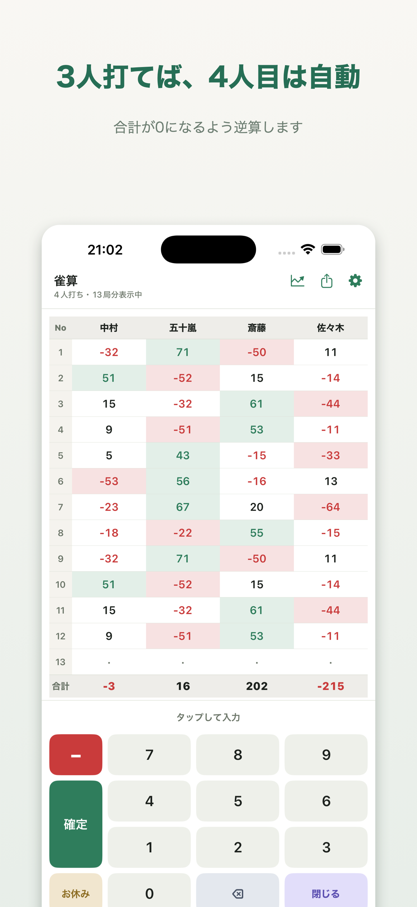
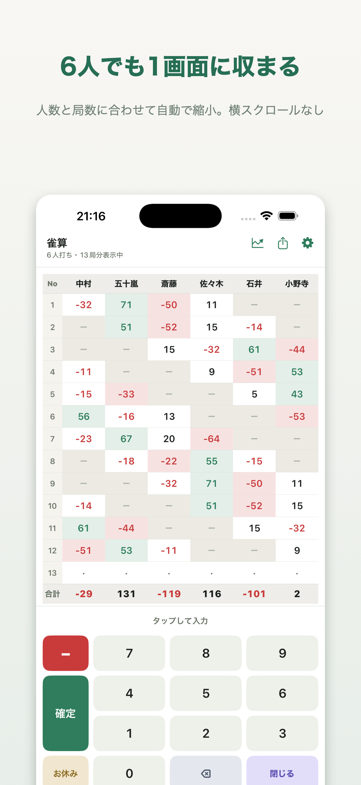
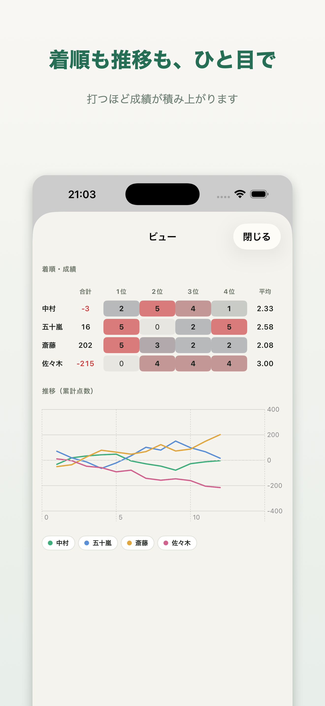
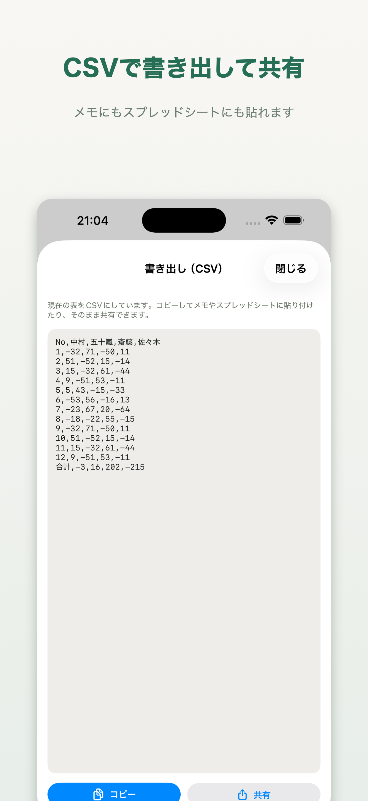

# 雀算（Jansan）

麻雀のスコアを「打つだけ」で記録する iOS アプリです。
余計な項目を削って、入力の速さだけを突き詰めています。

<p>
  
  
  
  
</p>

## 特徴

- **3人分を入れれば4人目は自動** — その局の合計が0になるよう逆算します。あとから他の人を訂正すれば連動して計算し直されます
- **2桁でそのまま次の人へ** — 「確定」を押す手間がありません。3桁を打ちたいときは続けて打てば入ります
- **5〜6人で回しても崩れない** — 3人分を入れたあと実際に打った4人目をタップすると確定し、残りはその局だけ自動で「お休み」になります
- **人数と局数に応じて自動縮小** — 横スクロールなし。縮みきったらスクロールに切り替え、名前の行と合計の行は常に見えたままです
- **閉じても消えない** — 入力中の内容は自動保存。残したい対局は日付付きで記録できます
- **記録はiCloudに残る** — お使いのiCloud（プライベートデータベース）に同期するので、端末が壊れても機種を変えても記録は消えません。開発者からも他の利用者からも見えません
- **広告も解析も入っていない** — 点数が開発者や第三者へ送られることはありません。外部と通信するのは、iCloudへの同期と、任意の「開発者にコーヒーを奢る」（App内課金）のときだけです

## 構成

```
JansanCore/   点数計算のロジック（UI非依存・テスト39本）
Jansan/       iOSアプリ（SwiftUI）
docs/         サポートページとプライバシーポリシー（GitHub Pages）
store/        App Store提出用のスクリーンショットと掲載文
```

計算の中身はすべて `JansanCore` に閉じています。UIから切り離してあるので、
逆算・自動移動・お休み判定・着順集計といった一番壊れやすい部分をテストで固定できます。

```bash
cd JansanCore && swift test
```

マスの状態は enum で表現していて、「手入力なのにお休み」のような
あり得ない組み合わせをそもそも作れないようにしています。

```swift
enum Entry {
    case empty          // 入力待ち
    case resting        // その局は不参加
    case entered(Int)   // 手入力
    case derived(Int)   // 合計0から逆算
}
```

## ビルド

Xcode 26 以降が必要です。対応は iOS 18.0 以降の iPhone。

```bash
open Jansan/Jansan.xcodeproj
```

`JansanCore` はローカルの Swift Package として参照しているため、追加の取得作業はありません。

## 開発用の道具

- `Tools-MakeIcon.swift` — アプリアイコンを生成します
- `store/MakeScreenshots.swift` — スクリーンショットに見出しを載せて App Store 用に組みます

どちらも `swiftc` で直接コンパイルして実行できます。

## ライセンス

未定。
